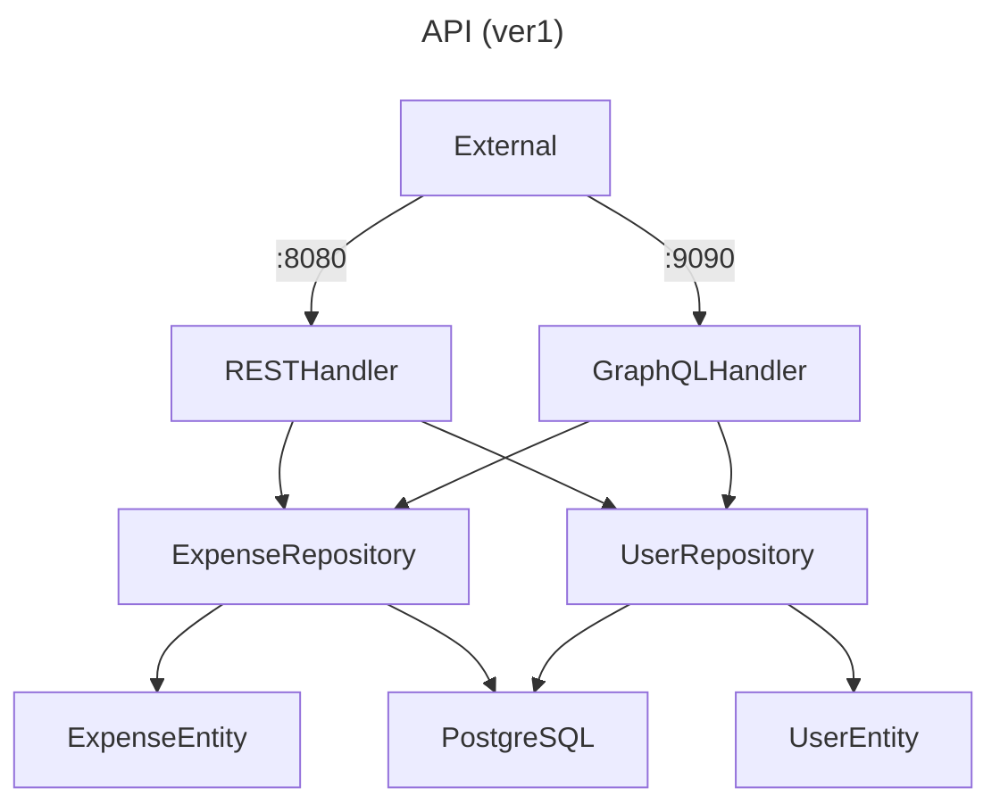
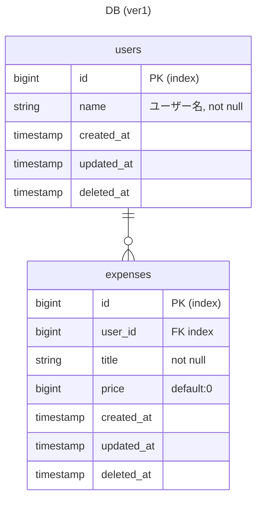

## GOでREST, gRPC, GraphQLのAPIを設計する
<!-- ロゴとラベルの色はここから https://simpleicons.org -->

**概要**

家計簿を管理するAPIを作ってみる
- `Expense`: 支払いを管理する (title, price, user_idなどを持つ)
- `User`: ユーザーを管理 (nameなどを持つ)

**Todo**
- [x] OpenAPIでスキーマを作成する https://github.com/tf63/go_api/issues/1
- [x] Repositoryを作成する https://github.com/tf63/go_api/issues/4 https://github.com/tf63/go_api/issues/5
- [x] Entityを作成する https://github.com/tf63/go_api/issues/3
- [x] RESTサーバーを実装する https://github.com/tf63/go_api/issues/2
- [x] RESTサーバーをテストする https://github.com/tf63/go_api/issues/9 https://github.com/tf63/go_api/issues/13
- [x] gqlgenでスキーマを作成する https://github.com/tf63/go_api/issues/11
- [x] GraphQLサーバーを実装する https://github.com/tf63/go_api/issues/10
- [ ] GraphQLサーバーをテストする https://github.com/tf63/go_api/issues/12
- [ ] gRPCサーバーを実装する
- [ ] gRPCサーバーをテストする
- [ ] Add delight to the experience when all tasks are complete :tada:

**動作確認**
- REST https://github.com/tf63/go_api/issues/2
- GraphQL https://github.com/tf63/go_api/issues/10

**技術選定**
| 技術 | 役割 |
| - | - |
| net/http | サーバー (標準ライブラリ) |
| GORM | ORM |
| OpenAPI | REST用ライブラリ |
| oapi-codegen | OpenAPIのコード生成 |
| gqlgen | GraphQLライブラリ |
| testify | Goのテストライブラリ |
| godoc | ドキュメント生成 |
| Postman | APIの動作確認 |
| PostgreSQL | DB |
| pgAdmin | DBの監視 |
| Docker | 開発環境 |
| Github Actions | CI |

### 設計など

**API設計**

**テーブル設計**

