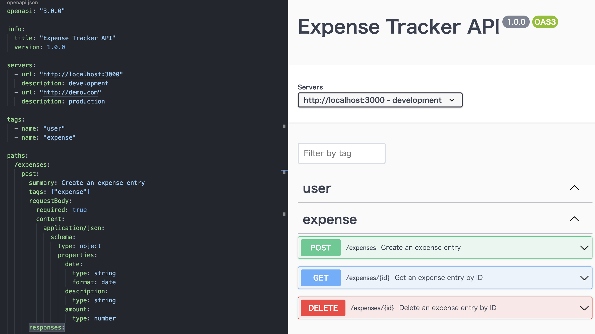

## APIの実装周り
### OpenAPI

- OpenAPI = Specification
- Swagger = Tools for implementing the specification

https://swagger.io/blog/api-strategy/difference-between-swagger-and-openapi/

### Swagger Viewer
`OpenAPI`を確認するためのVSCodeの拡張機能



### oapi-codegen
https://github.com/deepmap/oapi-codegen/tree/master/examples/petstore-expanded

**インストール**
go installもしないとだめ
```
    go get github.com/deepmap/oapi-codegen/cmd/oapi-codegen@latest
    go install github.com/deepmap/oapi-codegen/cmd/oapi-codegen@latest
    go get github.com/deepmap/oapi-codegen/pkg/runtime@latest
    go get github.com/deepmap/oapi-codegen/pkg/types@latest
    # net/httpでもコード生成にchiが必要?
    # https://github.com/go-chi/chi
    go get -u github.com/go-chi/chi/v5
```

**コードの作成**

型情報の生成
```
    oapi-codegen --generate "types" --package rest api/rest/openapi.yaml > api/rest/types.gen.go
```

サーバーのインターフェースの生成
- Echo: `--generate server`
- Chi: `--generate chi-server`
- Gin: `--generate gin`
- **net/http: `--generate chi-server`**
- https://github.com/deepmap/oapi-codegen/tree/master#registering-handlers
```
    oapi-codegen --generate "chi-server" --package rest api/rest/openapi.yaml > api/rest/server.gen.go
```

(全部生成)
```
    oapi-codegen api/rest/openapi.yaml > api/rest/openapi.gen.go
```