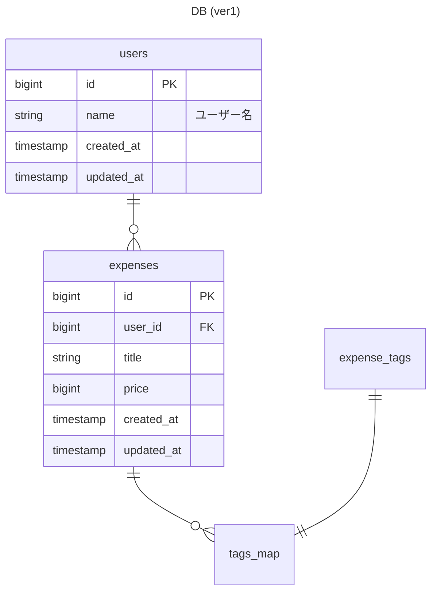
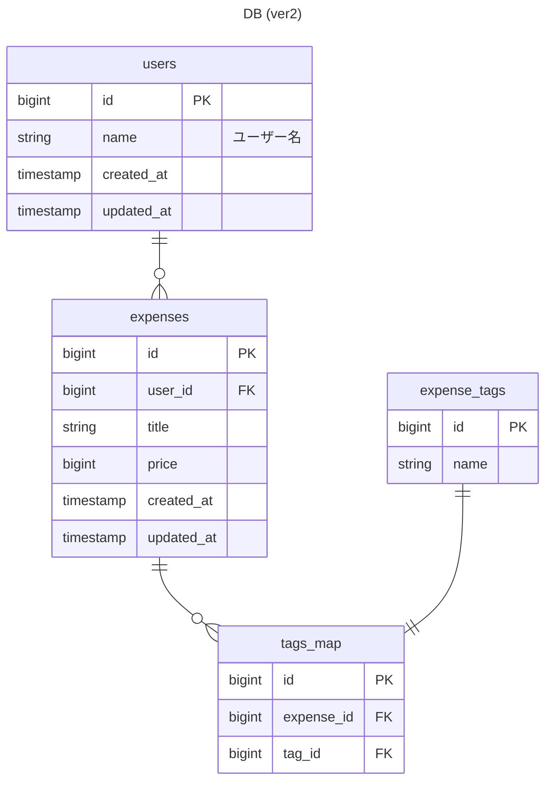

## DB設計

```mermaid
---
title: DB (ver1)
---
erDiagram
    users ||--o{ expenses: ""
    expenses ||--o{ tags_map: ""
    expense_tags ||--|| tags_map: ""
    users {
        bigint id PK
        string name "ユーザー名"
        timestamp created_at
        timestamp updated_at
    }

    expenses {
        bigint id PK
        bigint user_id FK
        string title
        bigint price
        timestamp created_at
        timestamp updated_at
    }

```

```mermaid
---
title: DB (ver2)
---
erDiagram
    users ||--o{ expenses: ""
    expenses ||--o{ tags_map: ""
    expense_tags ||--|| tags_map: ""
    users {
        bigint id PK
        string name "ユーザー名"
        timestamp created_at
        timestamp updated_at
    }

    expenses {
        bigint id PK
        bigint user_id FK
        string title
        bigint price
        timestamp created_at
        timestamp updated_at
    }

    expense_tags {
        bigint id PK
        string name
    }

    tags_map {
        bigint id PK
        bigint expense_id FK
        bigint tag_id FK
    }

```

### 参考

タグ付け

https://senews.jp/toxi1/

接続関係

https://mermaid.js.org/syntax/entityRelationshipDiagram.html#relationship-syntax