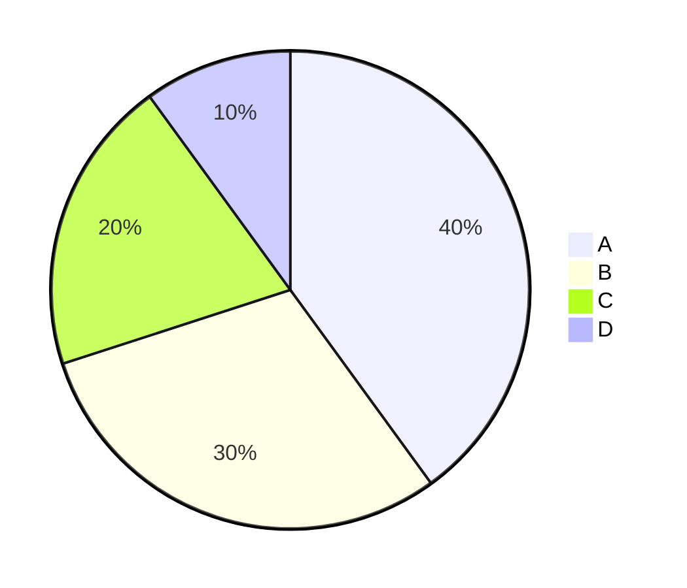

## mermaid
Markdown上でUML図を作成できる

Github，Qiitaでもサポートされている

VSCodeの拡張機能がある 
- Markdown Preview Mermaid Support (`bpruitt-goddard.mermaid-markdown-syntax-highlighting`)
- Mermaid Markdown Syntax Highlighting (`bierner.markdown-mermaid`)

### サンプル

### 参考
mermaid 公式

https://mermaid.js.org/syntax/entityRelationshipDiagram.html

mermaidのサンプル (一般的なもの)

https://qiita.com/caesar_cat/items/e8a116a585863633d15a

mermaidのサンプル (DB)

https://zenn.dev/aldagram_tech/articles/a10166f763d30e

VSCodeでmermaidのプレビューを使う

https://qiita.com/sato_kana/items/2a13f19017576488f017